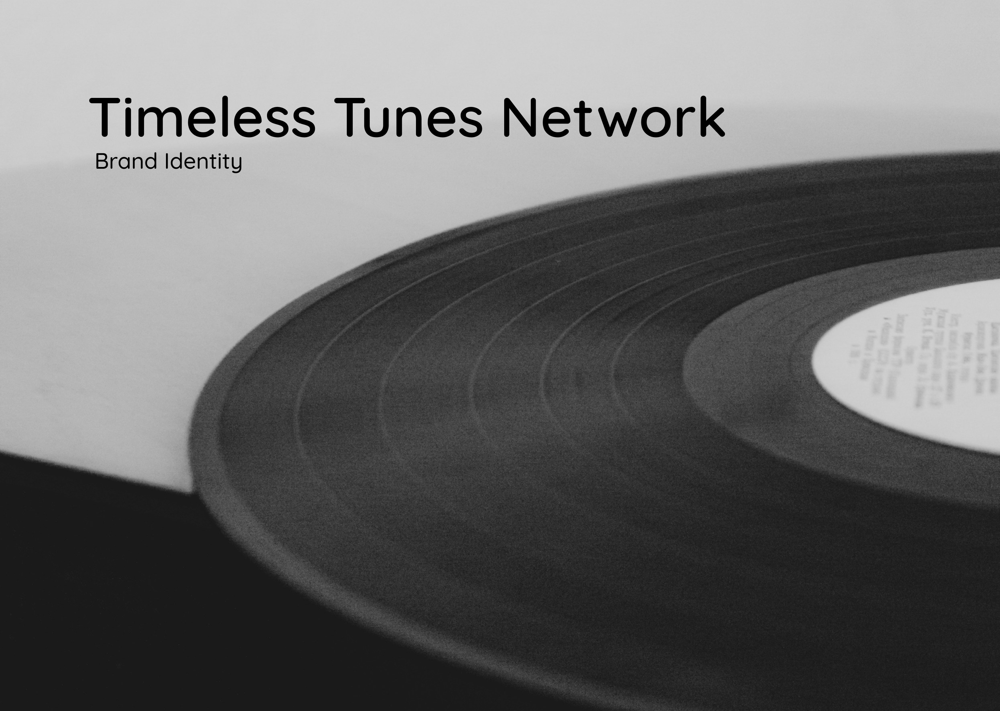
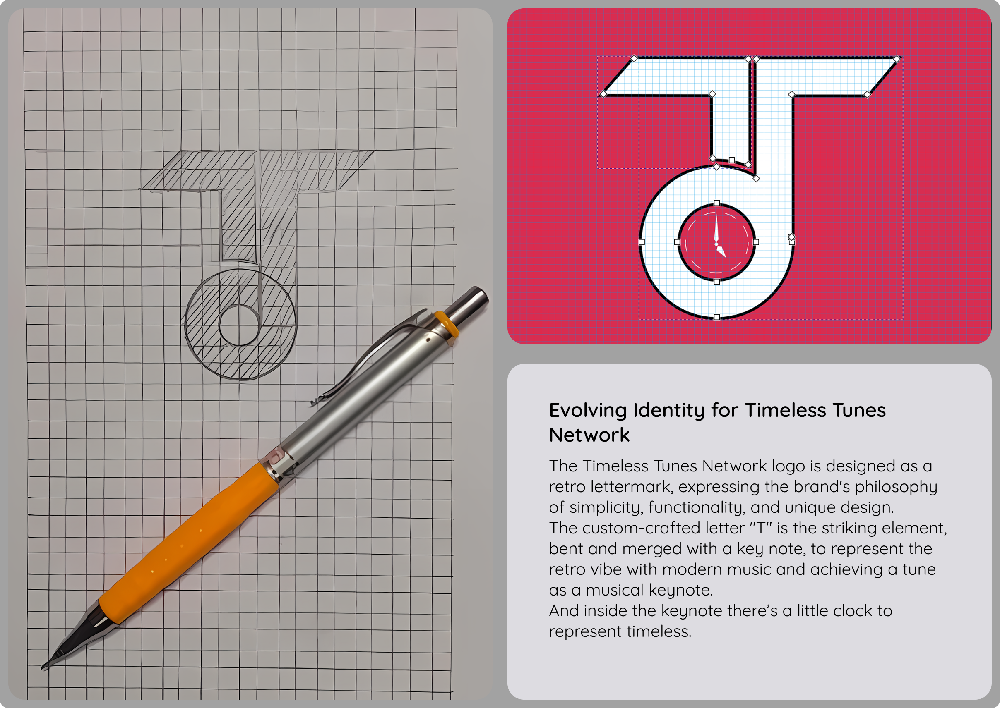
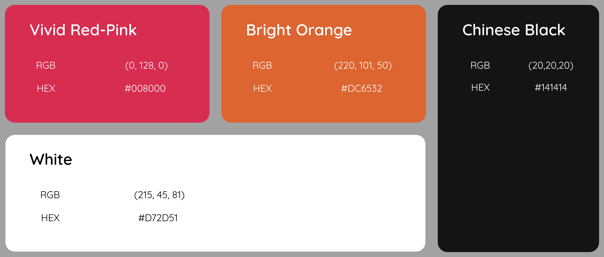
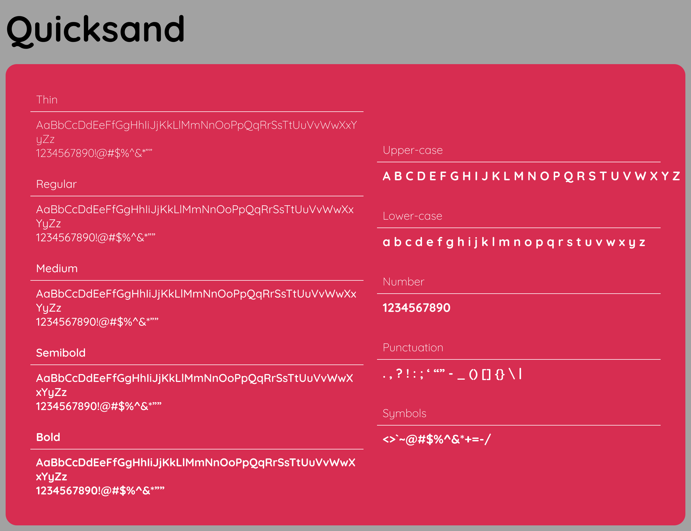

# 🎵 Timeless Tunes Network — Brand Identity Design Case Study

> A complete brand identity design project created in **Figma**, focused on building a timeless, memorable, and scalable visual identity for a music-centric brand. This project covers logo design, brand strategy, color psychology, typography selection, visual consistency, and real-world brand applications.

---

<div align="center">

# 🎧 Timeless Tunes Network

### Brand Identity Design • Logo System • Visual Language • Brand Guidelines


</div>

---

# 📑 Table of Contents

* Overview
* Brand Background
* Design Objectives
* Brand Strategy
* Logo Design Process
* Color Palette
* Typography
* Logo Variations
* Mockups & Applications
* Design System
* Challenges
* Learnings
* Final Outcome

---

# 🌟 Project Overview

Timeless Tunes Network is a music-focused brand that celebrates timeless melodies and meaningful musical experiences across generations.

The goal of this project was to create a visual identity that communicates:

🎵 Music
🎵 Nostalgia
🎵 Creativity
🎵 Community
🎵 Modern Digital Presence

The identity needed to feel both **classic and contemporary**, reflecting the enduring nature of music while remaining relevant in today's digital world.

---

# 🖼️ Project Showcase

> Replace the image paths below with exported Figma screens.

```md
/assets/cover.png
/assets/logo-construction.png
/assets/color-palette.png
/assets/typography.png
/assets/mockups.png
```

| Cover Page                 |
| -------------------------- |
|  |

| Logo Construction                     | Color Palette                        |
| ------------------------------------- | ------------------------------------ |
|  |  |

| Typography                           | Mockups                        |
| ------------------------------------ | ------------------------------ |
|  |  |

---

# 🎯 Design Brief

### Brand Name

**Timeless Tunes Network**

### Industry

Music & Entertainment

### Project Type

Brand Identity Design

### Platform

Figma

---

# 🚀 Project Goals

The brand identity was designed to:

* Create strong visual recognition
* Reflect the essence of music
* Establish emotional connection
* Build a modern yet timeless aesthetic
* Ensure scalability across digital and print media

---

# 🎵 About Timeless Tunes Network

Timeless Tunes Network represents a space where music transcends generations.

The brand serves as a bridge between classic musical heritage and modern listening experiences, creating a recognizable identity that resonates with music lovers of all ages.

### Brand Values

❤️ Creativity

🎼 Musical Heritage

🌍 Community

⚡ Innovation

🎧 Authenticity

---

# 🧠 Brand Strategy

Before designing visuals, a strategic foundation was established.

### Brand Personality

| Trait    | Description                           |
| -------- | ------------------------------------- |
| Creative | Celebrates artistic expression        |
| Timeless | Inspired by enduring musical classics |
| Bold     | Memorable visual presence             |
| Friendly | Accessible and welcoming              |
| Modern   | Suitable for digital platforms        |

---

# ✏️ Logo & Branding

## Logo Concept

The logo combines:

* Initial letterform integration
* Music-inspired symbolism
* Strong geometric structure
* Balanced visual hierarchy

The identity was designed to create instant recognition while remaining adaptable across multiple touchpoints.

---

## Design Exploration

### Objective

Develop a logo that:

* Represents music culture
* Feels timeless
* Works across sizes
* Maintains visual clarity

### Process

1. Concept Sketching
2. Shape Exploration
3. Digital Refinement
4. Grid Construction
5. Brand Testing

---

# 🎨 Logo Construction

The logo was first explored through hand sketches before being refined digitally.

### Key Principles

✅ Simplicity

✅ Memorability

✅ Scalability

✅ Versatility

✅ Brand Recognition

---

# 🎨 Color Palette

The visual identity uses a vibrant and energetic palette that reflects creativity and passion.

---

## Primary Colors

### ❤️ Vivid Red Pink

```css
HEX: #D6285A
RGB: 214, 40, 90
```

Represents:

* Energy
* Passion
* Creativity

---

### 🧡 Bright Orange

```css
HEX: #E26C2F
RGB: 226, 108, 47
```

Represents:

* Enthusiasm
* Warmth
* Expression

---

### 🖤 Chinese Black

```css
HEX: #0B0B0B
RGB: 11, 11, 11
```

Represents:

* Sophistication
* Professionalism
* Contrast

---

### 🤍 White

```css
HEX: #FFFFFF
RGB: 255, 255, 255
```

Represents:

* Clarity
* Simplicity
* Balance

---

# 🎯 Color Psychology

The selected palette creates a balance between:

* Emotional connection
* Visual energy
* Brand confidence
* Creative expression

The combination allows the identity to stand out while remaining professional and highly recognizable.

---

# 🔤 Typography

## Primary Typeface

# Quicksand

The brand utilizes **Quicksand** as the primary typeface.

### Why Quicksand?

* Clean appearance
* Friendly personality
* High readability
* Modern geometric structure
* Excellent digital compatibility

---

## Typography Hierarchy

### Headings

```css
Font: Quicksand Bold
Weight: 700
```

### Subheadings

```css
Font: Quicksand SemiBold
Weight: 600
```

### Body Text

```css
Font: Quicksand Regular
Weight: 400
```

---

# 🏷️ Logo Variations

To ensure flexibility across platforms, multiple logo versions were created.

### Primary Logo

Used for:

* Website
* Social Media
* Marketing Materials

---

### Secondary Logo

Used for:

* Compact spaces
* Merchandise
* Mobile interfaces

---

### Monochrome Version

Used for:

* Print materials
* Single-color applications
* Embossing

---

### Reverse Version

Used on:

* Dark backgrounds
* Promotional assets

---

# 🛍️ Brand Applications

The identity was tested through real-world mockups to validate scalability and versatility.

---

## Merchandise

### Included Applications

* Tote Bags
* Stickers
* Packaging
* Shopping Bags
* Promotional Products

---

## Office Branding

Applications include:

* Signage
* Stationery
* Workplace Graphics

---

## Digital Assets

Applications include:

* Social Media
* Website Branding
* Digital Marketing Materials

---

## Music Merchandise

Applications include:

* Vinyl Records
* Album Packaging
* Promotional Stickers
* Event Branding

---

# 📸 Mockup Showcase

The branding system was applied to:

🎵 Vinyl Record Covers

🛍️ Tote Bags

📦 Packaging

☕ Coffee Mugs

💻 Laptop Stickers

🏢 Signboards

📢 Billboard Advertising

🎨 Promotional Merchandise

These applications demonstrate the flexibility and consistency of the identity across multiple touchpoints.

---

# 🎯 Design System Principles

The identity system follows:

### Consistency

Maintaining recognizable visual elements across all applications.

### Scalability

Ensuring usability from small icons to large billboards.

### Simplicity

Reducing unnecessary complexity.

### Memorability

Creating a distinctive visual presence.

---

# ⚡ Challenges

### Challenge 1

Balancing modern aesthetics with timeless musical themes.

### Solution

Combined geometric forms with classic music-inspired symbolism.

---

### Challenge 2

Creating a versatile logo system.

### Solution

Developed multiple logo variations and responsive adaptations.

---

### Challenge 3

Maintaining consistency across applications.

### Solution

Established clear visual guidelines and usage standards.

---

# 📚 Key Learnings

This project strengthened my understanding of:

* Brand Identity Design
* Logo Design Principles
* Visual Hierarchy
* Color Psychology
* Typography Systems
* Brand Consistency
* Design Thinking
* Mockup Presentation
* Professional Brand Documentation

---

# 🛠 Tools Used

| Tool                      | Purpose                  |
| ------------------------- | ------------------------ |
| Figma                     | Design & Documentation   |
| Adobe Photoshop           | Mockup Creation          |
| Brand Strategy Frameworks | Brand Development        |
| Color Theory              | Visual Identity Planning |

---

# 🏆 Final Outcome

The Timeless Tunes Network brand identity successfully delivers a bold, memorable, and scalable visual system that reflects the emotional power of music while maintaining a modern and professional appearance.

### Results

✅ Cohesive Brand Identity

✅ Strong Visual Recognition

✅ Multi-Platform Adaptability

✅ Effective Brand Communication

✅ Professional Presentation System

---

<div align="center">

# 🎵 Timeless Tunes Network

### "Where Timeless Music Meets Timeless Design"

**Brand Identity Design Case Study | Designed in Figma**

---

⭐ If you like this project, consider giving it a star!

</div>

---

